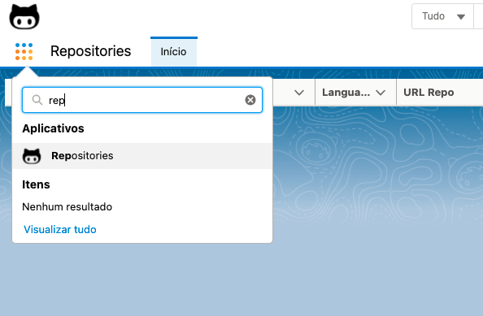
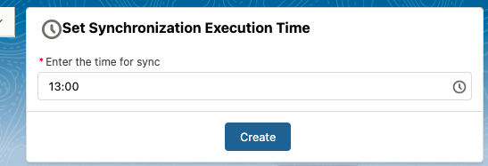
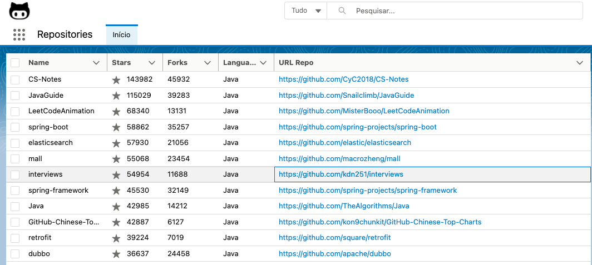

# salesforce-github-repos

# Install component using Scratch Org

1 - Authorize your hub and provide it with a alias(DevHub in the following command):

    sfdx force:auth:web:login -d -a DevHub

2 - Clone repository

    git clone git clone https://github.com/jeffersonmartins/salesforce-github-repos.git

3 - Navigate to the directory of the repository you just cloned.

    cd salesforce-github-repos

4 - Create a scratch org and provide it with an alias (salesforce-github-repos in the command bellow)

    sfdx force:org:create -s -f config/project-scratch-def.json -a salesforce-github-repos

5 - Push the component to your scratch org

    sfdx force:source:push -u salesforce-github-repos

6 - Open the sandbox org

    sfdx force:org:open -u salesforce-github-repos

7 - Launch app Repositories
 

 
 

8 - Set time for sync and click "Create"

 
 

9 - Await the time and then refresh the page

